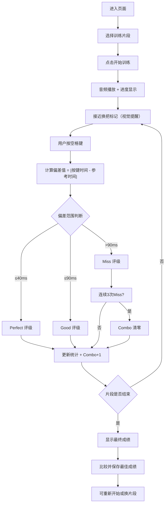

## 1. 产品概述
「四胡换把滑音时值偏差训练」是一款面向二人台戏班学员的纯浏览器节奏训练工具，通过播放参考音频片段，让学员在换把滑音标记处按下空格键，系统实时检测按键时刻与参考时刻的偏差，帮助学员精准掌握四胡换把滑音的时值。

- 核心目标：提升四胡演奏者换把滑音的时值准确度
- 目标用户：二人台戏班学员、四胡演奏学习者
- 产品价值：提供即时、量化的反馈，替代传统口传心授的训练方式

## 2. 核心 Features

### 2.1 Feature Module
1. **训练主界面**：音频播放控制、演奏提示、实时反馈展示
2. **数据统计面板**：Combo 连击、各把位命中率、平均偏差统计
3. **成绩系统**：个人最佳成绩记录与展示
4. **片段管理**：内置示例片段，支持自定义片段替换

### 2.2 Page Details
| 页面名称 | 模块名称 | Feature Description |
|---------|---------|---------------------|
| 训练主页面 | 音频播放区 | 播放/暂停控制、进度条显示、当前时间戳 |
| 训练主页面 | 演奏提示区 | 倒计时提示、换把标记可视化、把位信息展示 |
| 训练主页面 | 实时反馈区 | 按键瞬间显示偏差值与评级（Perfect/Good/Miss）、连击状态 |
| 训练主页面 | 数据统计面板 | 当前 Combo 数、各把位命中率柱状图、平均偏差、个人最佳成绩 |
| 训练主页面 | 控制区 | 开始训练、重新开始、片段选择 |

## 3. 核心流程

用户进入页面 → 选择训练片段 → 点击开始 → 音频播放 → 倒计时提示 → 接近换把标记时视觉提醒 → 用户按空格 → 系统计算偏差 → 显示评级 → 更新 Combo 和统计数据 → 片段结束 → 显示最终成绩 → 保存最佳记录

## 4. User Interface Design

### 4.1 设计风格
- **主色调**：深紫檀色 (#5C1A1A) 作为主色，代表传统乐器的木质质感；金色 (#D4AF37) 作为点缀，象征民乐的优雅
- **辅助色**：墨黑色 (#1A1A1A) 背景、宣纸白 (#F5F0E6) 文字
- **按钮风格**：圆角矩形，带有细微木纹质感，悬停时有金色光晕
- **字体**：标题使用「思源宋体」体现传统韵味，正文使用「思源黑体」保证可读性
- **布局风格**：居中对称布局，借鉴中国传统卷轴画的构图，两侧留白，核心内容居中
- **装饰元素**：细微的云纹背景纹理，传统回纹边框装饰

### 4.2 页面设计概述
| 页面名称 | 模块名称 | UI Elements |
|---------|---------|-------------|
| 训练主页面 | 音频播放区 | 深色木质背景，金色进度条，播放按钮为传统纹样装饰的圆形按钮 |
| 训练主页面 | 演奏提示区 | 中央大字体倒计时，换把标记以金色光点在时间轴上流动，到达时闪烁提示 |
| 训练主页面 | 实时反馈区 | 按键瞬间弹出评级动画，Perfect 金色、Good 绿色、Miss 红色，带有弹跳效果 |
| 训练主页面 | 数据统计面板 | 左侧 Combo 数字大号展示，右侧各把位命中率柱状图，底部平均偏差与最佳成绩 |
| 训练主页面 | 控制区 | 底部横向排列的控制按钮，木纹质感，金色文字 |

### 4.3 响应性
- Desktop-first 设计，主要面向桌面端训练使用
- 适配平板设备，保证按键区域足够大
- 关键触控区域不小于 48x48px

### 4.4 动效设计
- 页面加载：卷轴展开式动画，内容从中央向两侧渐显
- 换把提示：金色光点从左向右流动，接近标记时脉冲闪烁
- 按键反馈：评级文字从中心放大弹出，带有粒子散射效果
- Combo 增加：数字跳动动画，超过 10 连击时边框发光
- 成绩更新：数字滚动动画，最佳成绩打破时有彩带效果
