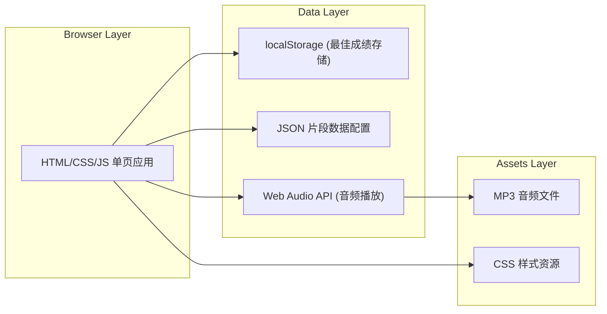

## 1. Architecture Design



## 2. Technology Description

- **前端框架**：原生 HTML5 + CSS3 + JavaScript (ES6+)，无需框架，保证最轻量、最快速的加载
- **构建工具**：Vite 5.x，用于开发服务器和生产构建
- **音频处理**：Web Audio API + HTML5 Audio Element，精确时间控制
- **数据存储**：localStorage 存储个人最佳成绩
- **容器化**：Nginx Alpine 镜像，Docker 一键部署
- **样式方案**：原生 CSS 变量 + CSS Grid/Flexbox，无需 CSS 预处理器

**技术选型理由**：
1. 纯原生方案保证零依赖、启动快、部署简单
2. Web Audio API 提供毫秒级时间精度，满足训练要求
3. localStorage 无需后端即可持久化用户数据
4. Docker + Nginx 确保生产环境稳定运行

## 3. Route Definitions

| Route | Purpose |
|-------|---------|
| / | 训练主页面（单页应用，无路由） |

## 4. Data Model

### 4.1 训练片段数据结构

```typescript
interface PositionMarker {
  timeMs: number;      // 换把时刻（毫秒偏移）
  position: number;    // 把位号（1-4）
  label?: string;      // 可选标注
}

interface TrainingSegment {
  id: string;
  name: string;
  description: string;
  audioFile: string;   // MP3 文件路径
  durationMs: number;  // 片段总时长
  markers: PositionMarker[];  // 换把标记时刻表
  preCountDownMs: number;     // 开始前倒计时（毫秒）
}
```

### 4.2 训练结果数据结构

```typescript
interface AttemptResult {
  markerIndex: number;
  position: number;
  expectedTimeMs: number;
  actualTimeMs: number;
  deviationMs: number;
  rating: 'perfect' | 'good' | 'miss';
}

interface SessionStats {
  totalAttempts: number;
  perfectCount: number;
  goodCount: number;
  missCount: number;
  currentCombo: number;
  maxCombo: number;
  consecutiveMisses: number;
  averageDeviation: number;
  positionStats: Record<number, {
    total: number;
    hit: number;      // perfect + good
    perfect: number;
    good: number;
    miss: number;
    avgDeviation: number;
  }>;
  results: AttemptResult[];
}

interface BestRecord {
  segmentId: string;
  maxCombo: number;
  accuracy: number;   // (perfect + good) / total
  averageDeviation: number;
  timestamp: number;
}
```

### 4.3 评分阈值配置

```typescript
const RATING_THRESHOLDS = {
  PERFECT: 40,   // ≤40ms
  GOOD: 90,      // ≤90ms
  MISS: Infinity // >90ms
};

const COMBO_RULES = {
  MAX_CONSECUTIVE_MISS: 3  // 连续3次miss断combo
};
```

## 5. 核心模块划分

### 5.1 AudioPlayer 模块
- 音频加载、播放、暂停、停止
- 精确的当前时间获取（毫秒级）
- 播放进度回调

### 5.2 TrainingEngine 模块
- 训练流程控制（开始、暂停、重置、结束）
- 标记检测与匹配（按键对应到最近的标记）
- 偏差计算与评级
- Combo 逻辑管理
- 统计数据更新

### 5.3 Storage 模块
- localStorage 读写封装
- 最佳成绩的保存与查询
- 数据版本管理

### 5.4 UIRenderer 模块
- 进度条渲染
- 标记点可视化
- 实时反馈动画
- 统计数据展示
- 柱状图绘制（Canvas）

### 5.5 InputHandler 模块
- 空格键监听
- 防止重复按键
- 按键时间戳精确记录

## 6. 文件结构

```
project/
├── index.html              # 主页面
├── package.json            # 项目配置
├── vite.config.js          # Vite 配置
├── Dockerfile              # Docker 构建
├── nginx.conf              # Nginx 配置
├── README.md               # 说明文档
├── src/
│   ├── main.js             # 入口文件
│   ├── config/
│   │   └── segments.js     # 训练片段配置
│   ├── modules/
│   │   ├── AudioPlayer.js  # 音频播放器
│   │   ├── TrainingEngine.js # 训练引擎
│   │   ├── Storage.js      # 本地存储
│   │   ├── UIRenderer.js   # UI 渲染
│   │   └── InputHandler.js # 输入处理
│   └── styles/
│       └── main.css        # 主样式
└── public/
    └── audio/
        └── sample.mp3      # 示例音频片段
```
